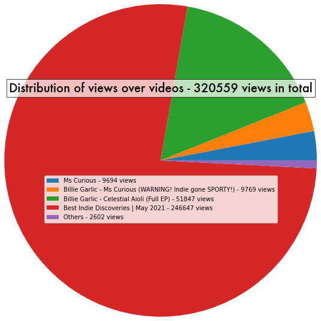

# YT-Views-Count
A jupyter notebook that counts and visualizes the number of views that my Indie Band [Billie Garlic](https://open.spotify.com/artist/2KZoVTprHSLoYX7G38MBh9?si=R92K6MuyS7CVYXcQfcbmHw&dl_branch=1) has on YouTube.

The data is retrieved using requests and BeautifulSoup, then it is treated using pandas.

See [visualisation notebook](./src/visualise.ipynb) for all visualisations.
